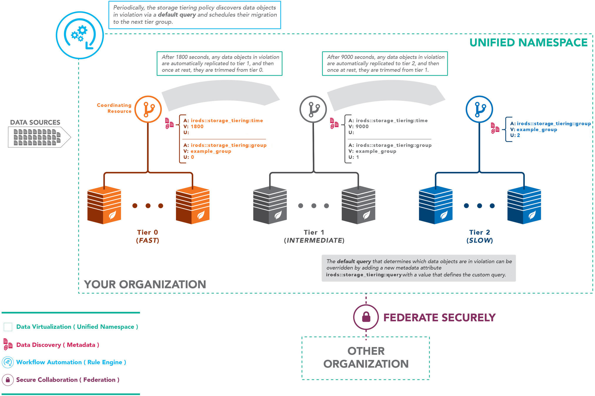

# **iRODS Storage Tiering Rule Engine Plugin**

The storage tiering framework provides iRODS the capability of automatically moving data between any number of identified tiers of storage within a configured tiering group.

To define a storage tiering group, selected storage resources are labeled with metadata which define their place in the group and how long data should reside in that tier before being migrated to the next tier.

The example diagram below shows a configuration with three tiers.



 # **System Architecture**

 The storage tiering capability is composed of a set of individual policies, each of which may also be composed of additional policies.  Hierarchically they can be visualized as:
 * Access Time
 * Data Movement
    * Data Replication
    * Data Verification
    * Data Retention
 * Metadata Application

Through the composition of policy through the iRODS rule engine plugin framework, the storage tiering rule engine plugin may take advantage of the strong default behavior while allowing for the provision of advanced configuration.  An administrator may override one or more of these composed policies via another rule base or rule engine plugin.  The entirety of data_movement may be reimplemented, or one of its components such as data replication.  For instance, should an administrator wish to use an external service to replicate and register a data object, the `irods_policy_data_replication` policy can be overriden to leverage the external service and then call the iRODS API to register the additional replica while the other policies remain default.

**Policy Signatures**

```
irods_policy_apply_access_time(object_path, collection_type, metadata_attribute)
irods_policy_data_movement(inst_name, object_path, user_name, source_replica_number, source_resource, destination_resource, preserve_replicas, verification_type)
irods_policy_data_replication(inst_name, source_resource, destination_resource, object_path)
irods_policy_data_verification(inst_name, verification_type, source_resource, destination_resource, object_path)
```

**Example Replication Policy**

For example, using the native iRODS rule language, the replication policy may be overridden to simply call the replication microservice.

```
irods_policy_data_replication(*inst_name, *src_resc, *dst_resc, *obj_path) {
    *err = errormsg(msiDataObjRepl(
                        *obj_path,
                        "rescName=*src_resc++++destRescName=*dst_resc",
                        *out_param), *msg)
     if(0 != *err) {
         failmsg(*err, "msiDataObjRepl failed for [*obj_path] [*src_resc] [*dst_resc] - [*msg]")
     }
 } # irods_policy_data_replication
```

# **Rulebase Configuration**

To configure the storage tiering capability the rule engine plugins must be added as new json objects within the "rule_engines" array of the ```server_config.json``` file.  The ```plugin_name``` must be as follows, and each instance name of the plugin must be unique.  By convention the plugin name plus the word **instance** is used.  Please note that the same instance name must be used across all servers which participate in tiering groups.  Data movement is delegated to the server hosting the source resource, and by convention remote rule calls are directed at specific plugin instances.

```
"rule_engines": [
    {
         "instance_name": "irods_rule_engine_plugin-storage_tiering-instance",
         "plugin_name": "irods_rule_engine_plugin-storage_tiering",
         "plugin_specific_configuration": {
         }
    },
    {
        "instance_name": "irods_rule_engine_plugin-apply_access_time-instance",
        "plugin_name": "irods_rule_engine_plugin-apply_access_time",
        "plugin_specific_configuration": {
        }
    },
    {
        "instance_name": "irods_rule_engine_plugin-data_verification-instance",
        "plugin_name": "irods_rule_engine_plugin-data_verification",
        "plugin_specific_configuration": {
        }
    },
    {
        "instance_name": "irods_rule_engine_plugin-data_replication-instance",
        "plugin_name": "irods_rule_engine_plugin-data_replication",
        "plugin_specific_configuration": {
        }
    },
    {
        "instance_name": "irods_rule_engine_plugin-data_movement-instance",
        "plugin_name": "irods_rule_engine_plugin-data_movement",
        "plugin_specific_configuration": {
        }
    },
    {
        "instance_name": "irods_rule_engine_plugin-irods_rule_language-instance",
        "plugin_name": "irods_rule_engine_plugin-irods_rule_language",
        "plugin_specific_configuration": {
            <snip>
        },
        "shared_memory_instance": "irods_rule_language_rule_engine"
    },
]
```

# **Configuring Metadata Attributes**
A number of metadata attributes are used within the storage tiering capability which identify the tier group, the time of data may be at rest within the tier, the optional query and so on.  These attributes may already map to concepts within a given iRODS installation.  For that reason we have exposed them as configuration options within the storage tiering plugin specific configuration block.  For a default installation the following values are used.

```
"plugin_specific_configuration": {
    "access_time_attribute" : "irods::access_time",
    "group_attribute" : "irods::storage_tiering::group",
    "time_attribute" : "irods::storage_tiering::time",
    "query_attribute" : "irods::storage_tiering::query",
    "verification_attribute" : "irods::storage_tiering::verification",
    "data_movement_parameters_attribute" : "irods::storage_tiering::restage_delay",
    "minimum_restage_tier" : "irods::storage_tiering::minimum_restage_tier",
    "preserve_replicas" : "irods::storage_tiering::preserve_replicas",
    "object_limit" : "irods::storage_tiering::object_limit",
    "default_data_movement_parameters" : "<EF>60s DOUBLE UNTIL SUCCESS OR 5 TIMES</EF>",
    "minumum_delay_time" : "irods::storage_tiering::minimum_delay_time_in_seconds",
    "maximum_delay_time" : "irods::storage_tiering::maximum_delay_time_in_seconds",
    "time_check_string" : "TIME_CHECK_STRING"
}
```

# **Creating a Tier Group**

Tier groups are defined via metadata AVUs attached to the resources which participate in the group.

In iRODS terminology, the `attribute` is defined by a function in the rule base **storage_tiering_configuration.re**, which by default is named **irods::storage_tiering::group**.  The `value` of the metadata triple is the name of the tier group, and the `unit` holds the numeric position of the resource within the group.  To define a tier group, simply choose a name and apply metadata to the selected root resources of given compositions.

For example:
```
imeta add -R fast_resc irods::storage_tiering::group example_group 0
imeta add -R medium_resc irods::storage_tiering::group example_group 1
imeta add -R slow_resc irods::storage_tiering::group example_group 2
```

This example defines three tiers of the group `example_group` where data will flow from tier 0 to tier 2 as it ages.  In this example `fast_resc` is a single resource, but it could have been set to `fast_tier_root_resc` and represent the root of a resource hierarchy consisting of many resources.

# **Setting Tiering Policy**

Once a tier group is defined, the age limit for each tier must also be configured via metadata.  Once a data object has remained unaccessed on a given tier for more than the configured time, it will be staged to the next tier in the group and then trimmed from the previous tier.  This is configured via the default attribute **irods::storage_tiering::time** (which itself is defined in the **storage_tiering_configuration.re** rulebase).  In order to configure the tiering time, apply an AVU to the resource using the given attribute and a positive numeric value in seconds.

For example, to configure the `fast_resc` to hold data for only 30 minutes:
```
imeta add -R fast_resc irods::storage_tiering::time 1800
```
We can then configure the `medium_resc` to hold data for 8 hours:
```
imeta add -R medium_resc irods::storage_tiering::time 28800
```

# **Randomizing Data Movement Times**

Data movement within a tier group is scheduled asynchronously using the iRODS delayed execution queue, which allows for many jobs to be run simultaneously.  In order to prevent the delayed execution server from being overwhelmed a wait time is applied to each job.  This time is determined randomly between two separate values configured through metadata.  By default the minum value is 1 second, and the maximum value is 30 seconds.  Should a tier within a group expect a high volume of traffic, these values can be adjusted to smaller or larger values.

```
imeta add -R ufs0 irods::storage_tiering::minimum_delay_time_in_seconds 1
imeta add -R ufs0 irods::storage_tiering::maximum_delay_time_in_seconds 30
```

# **Configuring Tiering Verification**

When a violating data object is identified for a given source resource, the object is replicated to the next resource in the tier.  In order to determine that this operation has succeeded before the source replica is trimmed, the storage tiering plugin provides the ability to perform three methods of verification of the destination replica.

In order of escalating computational complexity, first the system may just rely on the fact that no errors were caught and that the entry is properly registered in the catalog.  This is the default behavior, but would also be configured as such:
```
imeta add -R fast_resc irods::storage_tiering::verification catalog
```

A more expensive but reliable method is to check the file size of the replica on the destination resource (in this case, when a replica lands on `medium_resc`, check it):
```
imeta add -R medium_resc irods::storage_tiering::verification filesystem
```

And finally, the most computationally intensive but thorough method of verification is computing and comparing checksums.  Keep in mind that if no checksum is available for the source replica, such as no checksum was computed on ingest, the plugin will compute one for the source replica first.
```
imeta add -R slow_resc irods::storage_tiering::verification checksum
```

# **Restaging Tiered Data**

After data has been migrated within the system a user may wish to retrieve the data at a future time.  When this happens the data is immediately returned to the user, and an asynchronous job is submitted to restage the data to the lowest tier index in the tier group.  In the case where an administrator may not with the data to be returned to the lowest teir, such as when data is automatically ingested, the minimum tier may be indicated with a flag.  In this case the storage tiering plugin will restage the data to the indicated tier within the tier group.  To configure this option add the following flag to a root resource within the tier group:

```
imeta add -R medium_resc irods::storage_tiering::minimum_restage_tier true
```

# **Customizing the Violating Objects Query**

A tier within a tier group may identify data objects which are in violation by an alternate mechanism beyond the built-in time-based constraint.  This allows the data grid administrator to take additional context into account when identifying data objects to migrate.

Data objects which have been labeled via particular metadata, or within a specific collection, owned by a particular user, or belonging to a particular project may be identified through a custom query.  The default attribute **irods::storage_tiering::query** is used to hold this custom query.  To configure the custom query, attach the query to the root resource of the tier within the tier group.  This query will be used in place of the default time-based query for that tier.  For efficiency this example query checks for the existence in the root resource's list of leaves by resource ID.  Please note that any custom query must return DATA_NAME, COLL_NAME, USER_NAME, DATA_REPL_NUM in that order as it is a convention of this rule engine plugin.

```
imeta set -R fast_resc irods::storage_tiering::query "SELECT DATA_NAME, COLL_NAME, USER_NAME, DATA_REPL_NUM WHERE META_DATA_ATTR_NAME = 'irods::access_time' AND META_DATA_ATTR_VALUE < 'TIME_CHECK_STRING' AND DATA_RESC_ID IN ('10068', '10069')"
```

The example above implements the default query.  Note that the string `TIME_CHECK_STRING` is used in place of an actual time.  This string will be replaced by the storage tiering framework with the appropriately computed time given the previous parameters.

Any number of queries may be attached in order provide a range of criteria by which data may be tiered, such as user applied metadata.  To allow a user to archive their own data via metadata they may tag an object such as ```archive_object true```.  The tier may then have a query added to support this.
```
imeta set -R fast_resc irods::storage_tiering::query "SELECT DATA_NAME, COLL_NAME, USER_NAME, DATA_REPL_NUM WHERE META_DATA_ATTR_NAME = 'archive_object' AND META_DATA_ATTR_VALUE = 'true' AND DATA_RESC_ID IN ('10068', '10069')"
```

Queries may also be provided by using the Specific Query interface within iRODS.  The archive object query may be stored by an iRODS administrator as follows.
```
'iadmin asq "SELECT DATA_NAME, COLL_NAME, USER_NAME, DATA_REPL_NUM WHERE META_DATA_ATTR_NAME = 'archive_object' AND META_DATA_ATTR_VALUE = 'true' AND DATA_RESC_ID IN ('10068', '10069')" archive_query
```

At which point the query attached to the root of a storage tier would require the use of a metadata unit of ```specific```:
```
imeta set -R fast_resc irods::storage_tiering::query archive_query specific
```

# **Preserving Replicas for a given Tier**

Some users may not wish to trim a replica from a tier when data is migrated, such as to allow data to be archived and also still available on fast storage.  To preserve a replica on any given tier, attach the following metadata flag to the root resource.
```
imeta set -R medium_resc irods::storage_tiering::preserve_replicas true
```

# **Limiting the Violating Query results**

When working with large sets of data throttling the amount of data migrated at one time can be helpful.  In order to limit the results of the violating queries attach the following metadata attribute with the value set as the query limit.
```
imeta set -R medium_resc irods::storage_tiering::object_limit DESIRED_QUERY_LIMIT
```

# **Logging Data Transfer**

In order to log the transfer of data objects from one tier to the next, the storage tiering plugin on the ICAT server can be configured by setting ```"data_transfer_log_level" : "LOG_NOTICE"``` in the plugin_specific_configuraiton.  By default the log level is set to `LOG_DEBUG`.


```
{
    "instance_name": "irods_rule_engine_plugin-storage_tiering-instance",
    "plugin_name": "irods_rule_engine_plugin-storage_tiering",
    "plugin_specific_configuration": {
        "data_transfer_log_level" : "LOG_NOTICE"
    }
},
```

